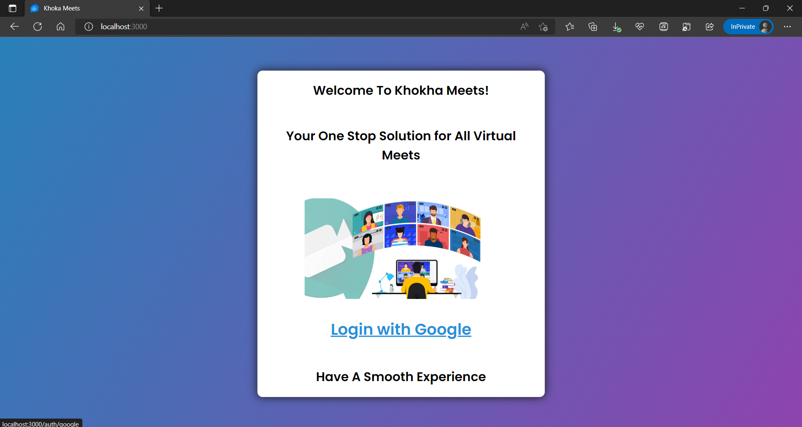
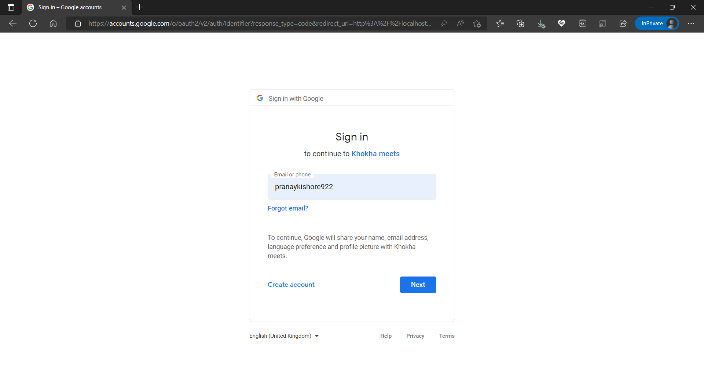
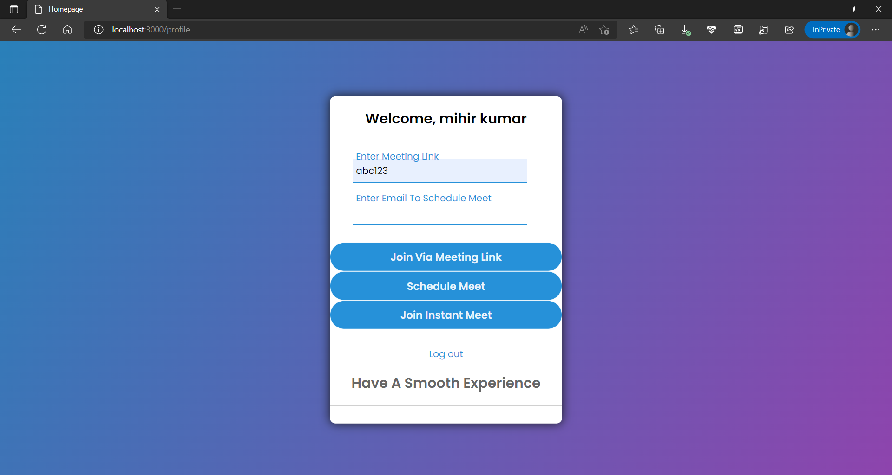
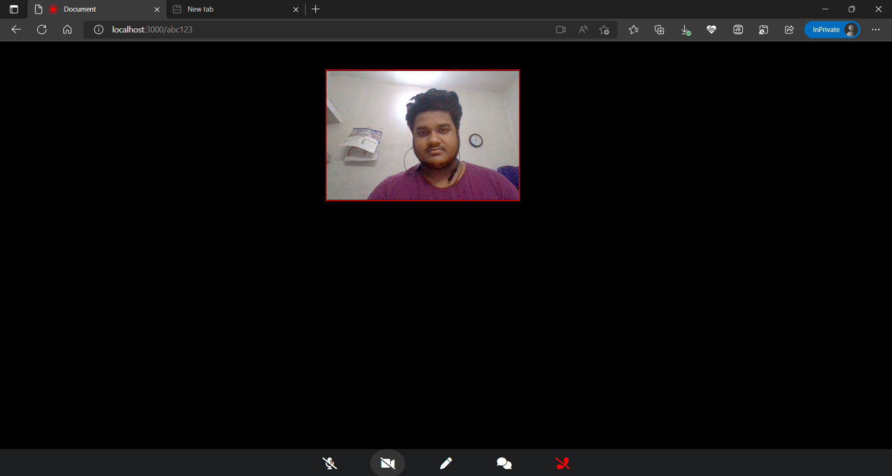
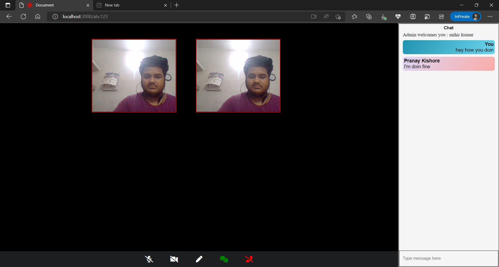
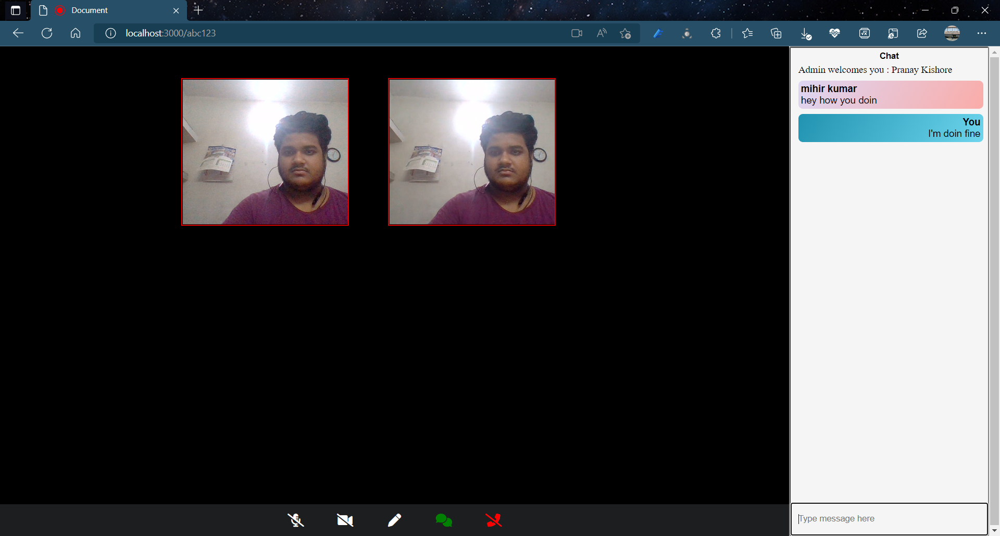
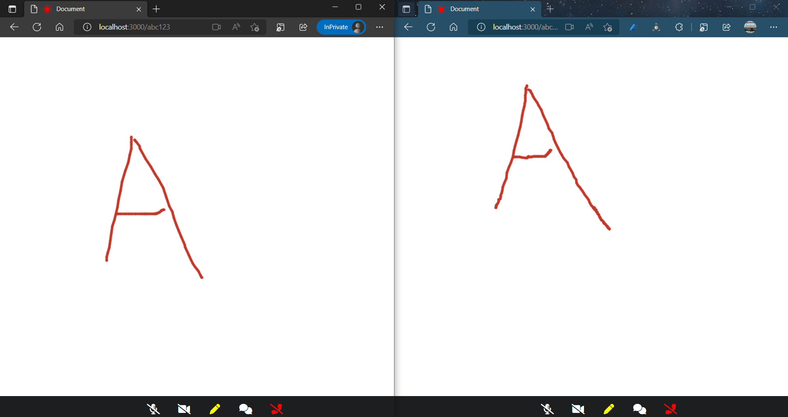
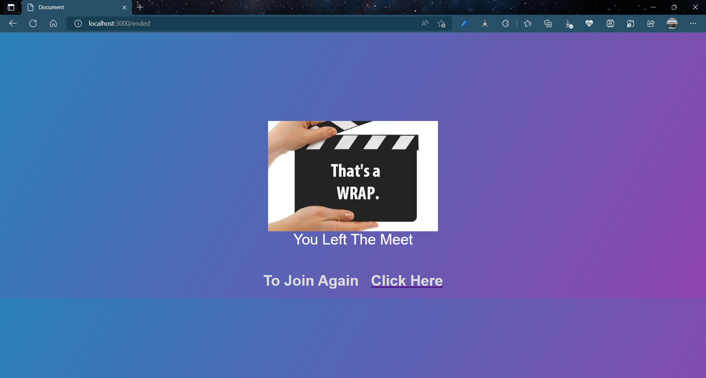

# Khokha_Meets
**This is a video conferencing web application which connects friends family and colleagues and allows them to chat, voice over talk, and exchnage ideas over a collaborative white board.**
## Dependencies used
   * [Mongoose](https://mongoosejs.com/docs/)
   * [EJS](https://ejs.co/)
   * [Express](http://expressjs.com/)
   * [Passport](http://www.passportjs.org/docs/)
   * [Socket.IO](https://socket.io/docs/v4/)
   * [WebRTC](https://webrtc.org/)
   * [Peer.js](https://peerjs.com/)
   * [Nodemailer](https://nodemailer.com/about/)
## Installation
### Cloning the repository:
- Clone the repository using `git clone https://github.com/Pranay922/Khokha_Meets.git` .
### Installing dependencies:
- Run `npm install`.

## Starting the server and peerjs
- Open terminal and Run `npm start` to start the server.
- Open a new terminal Run `peerjs --port 3001` to start peerjs for establishing peer to peer connection.
- Open http://localhost:3000 to view it in the browser.

## Welcome Page
  
## Sign in Page
  
## Join Meeting 
  
## Meeting Home
  
## Chat Section
     
## Collaborative White Board
  
## Meeting End
  

## Contributors:
- [Aniket Kumar](https://github.com/AniketKumarC007)
- [Deepak Prasad](https://github.com/Dkps0081)
- [Nandan Kumar](https://github.com/nandan5719)
- [Pranay Kishore](https://github.com/Pranay922)

